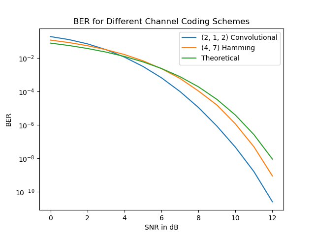

# Program 5 - Channel Coding



## Running the code

The c files have been compiled for use on Windows and Linux. With the correct
shared library file (.dll for Windows and .so for Linux) in the directory,
simply run:

```bash
python3 ChannelCoding.py
```

## Building from source

Use `make` to compile the shared library binaries for either Windows or Linux.

Linux:
```bash
make
```

Windows:
```bash
make windows
```

